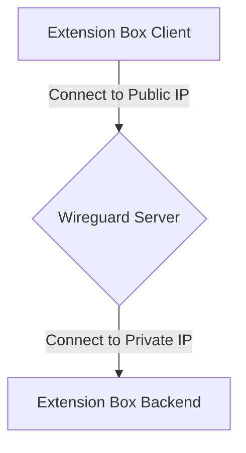
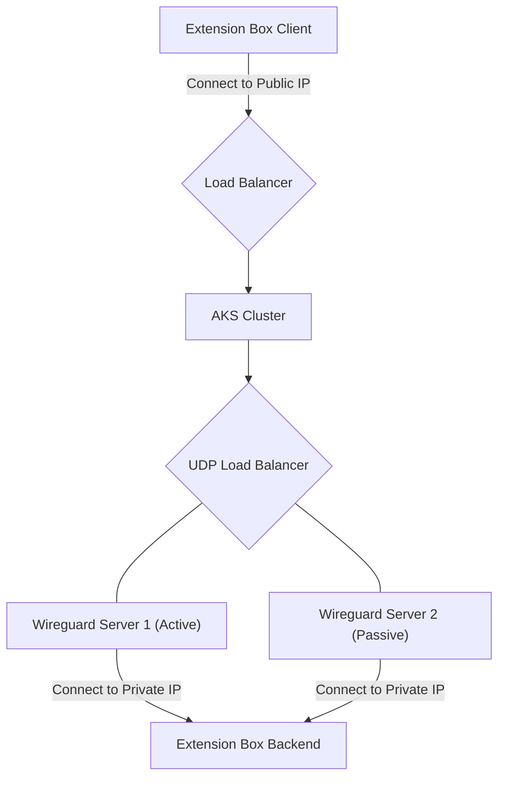
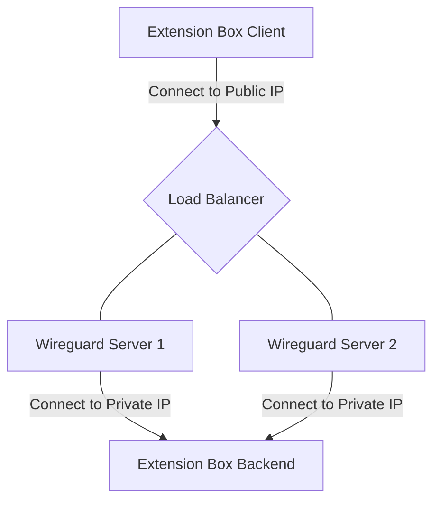

# Wireguard Connections

## Single Instance

Disadvantages:

- No HA

Advantages:

- Less complexity, simple setup
- Routing both ways is synchronous

## Active / Passive with AKS

Disadvantages:

- Needs correctly configured NGINX reverse proxy

Advantages:

- Routing both ways is synchronous
- HA Setup possible
- Wireguard servers can be configured as active / passive
- Proxy runs as container

## Active / Active with Azure Loadbalancer

Disadvantages:

- No Active / Passive setup possible (Azure LoadBalancer limitation)
- Connections to Wireguard servers are random because of Active / Active
- Reverse connection from Backend to Client is random because of possible async routing (Active / Active issues)

Advantages:

- Native Azure components
- Automated with ARM deployments