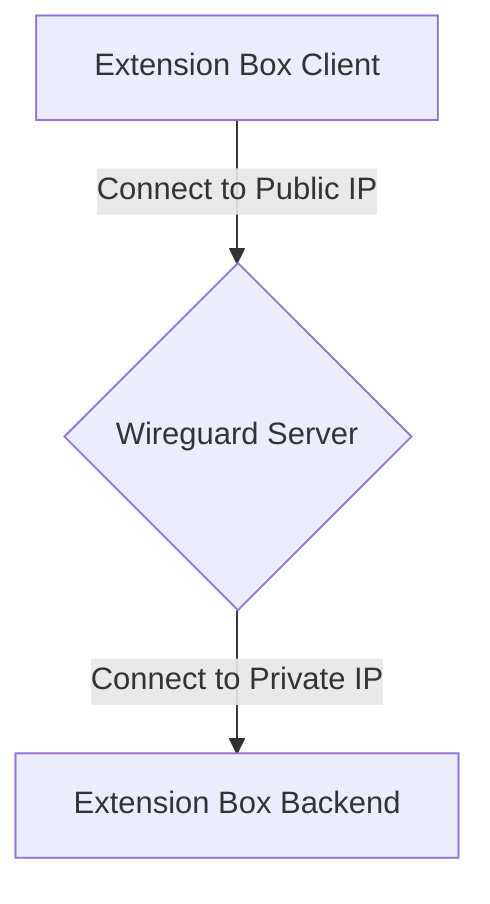
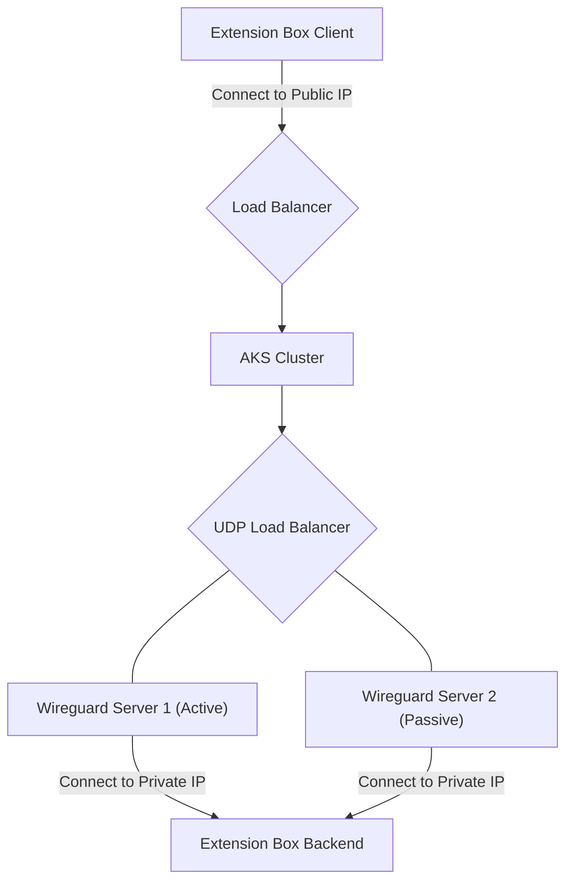
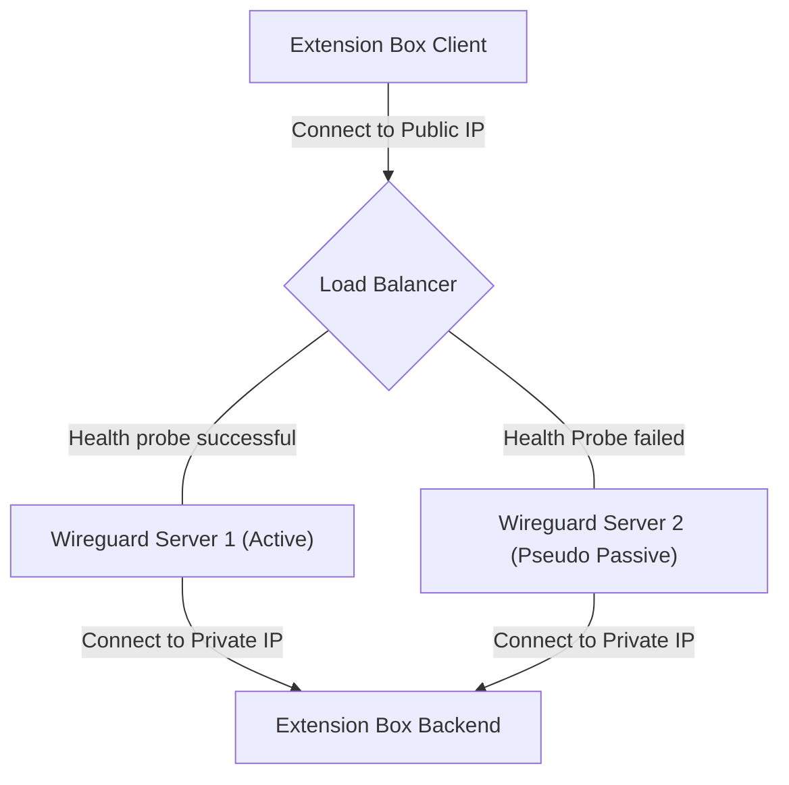
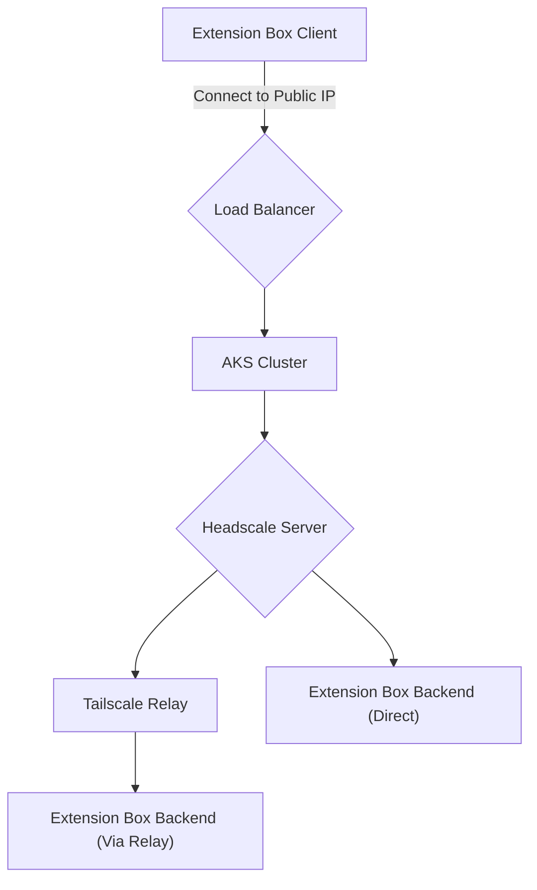

# Wireguard Connections

## Single Instance

Disadvantages:

- No HA

Advantages:

- Less complexity, simple setup
- Routing both ways is synchronous

## Active / Passive with AKS

Disadvantages:

- Needs correctly configured NGINX reverse proxy

Advantages:

- Routing both ways is synchronous
- HA Setup possible
- Wireguard servers can be configured as active / passive
- Proxy runs as container

## Active / Active with Azure Loadbalancer

Disadvantages:

- No Active / Passive setup possible (Azure LoadBalancer limitation)
- Connections to Wireguard servers are random because of Active / Active
- Reverse connection from Backend to Client is random because of possible async routing (Active / Active issues)
- Needs to manually set health probe of one Wireguard server as failed and needs to set the probe as healthy in case of incident so that synchronous routing works

Advantages:

- Native Azure components
- Automated with ARM deployments

## HA Solution with Headscale

Headscale is an open source version of Tailscale which makes it easy to connect multiple systems in a mesh network. The solution is deployed inside an AKS Cluster (HA by default) which acts as the server. Clients connect to the server. If direct connectivity cannot be ensured the connection will be made over a relay server in the internet. All communication is End-To-End encrypted with modern TLS encryption.

Advantages:

- Communication is possible both ways
- Uses clever technologies to do NAT traversal
- Uses relays (hosted by Tailscale) to make communication possible everywhere

Disadvantages:

- Setup on client on server is more involved
- Communication via relay causes slightly more latency
